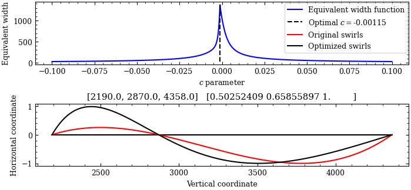

# Vulcan Calligraphy - Vanu-Tanaf-Kitaun


>"No learning is ever wasted. Wide experience increases wisdom, provided the experience is not sought purely for the stimulation of sensation. Our senses can deceive us and the knowledge they bring us is limited. We create machines to extend their limits, but these machines can also be deceived. To know the ultimate truth, we must transcend knowledge, go beyond surfaces that our senses detect, to understand without knowing. By not seeking, we find. For the Vulcan species to survive, this is the discipline we must master." - Surak, [Kir'Shara, First Analects Part 2: The thread of knowledge](https://kirshara.wordpress.com/2020/01/05/part-two-the-thread-of-knowledge/).

To be able to generate Vulcan calligraphy as the one demonstrated above has been a dream of mine for years. Since I do not quite possess the drawing skills to accurately and neatly draw Vulcan calligraphy. However, I am quite fond of programming. It was from this I was able to create a script that was able to produce the calligraphy, swirls and all, automatically from a romanized version of Vulcan. I now share this script with you so you can create your own calligraphic texts. If you encounter any problems or have suggestions, please feel free to reach out to me.
<!-- This project is able to generate Vulcan calligraphy from Romanized text. This is a work-in-progress project that I do for fun, so feedback and bug reports are welcome. -->

## Installation
### Required packages
The following is a list of packages that need to be installed via pip or some other tool:
- numpy
- matplotlib
- scipy
- svgpath2mpl

### Installation process
I am not an expert in GitHub, so this might not be the most efficient way to install it, but this method at least works on Windows 11 with Python 3.11
1) Start by downloading the GitHub repository.
2) Navigate to the directory in your favorite IDE, such as Visual Studio.
3) Create a virtual environment (not necessary, but can be nice), with
```
python3 -m venv venv
```
4) Enter the virtual environment with
```
.\venv\Scripts\activate 
```
5) In here, install the required packages with
```
pip install X
```
6) Run the **playground.py** script with
```
python .\playground.py
```

If everything ran correctly, you should see two new files, "Optimizer.png" and "Generated text.png".

## Glossary
* *Nuhm*: The vulcan symbols.
* *Patam*: The initial symbol in the top corner.
* *Plat*: The vertical spine.
* *Tel*: The aestetic swirls for compound words.

## How to use the script
To use the script, open the **playground.py** and add a variable called *string*, with the vulcan text you want to display. There are three rules for formatting the text that have to be followed to produce an accurate rendering.
1) Always add space after periods.
2) Always add 'name' directly before a name. Example: "nameStonn" for the name "Stonn".
3) Only use symbols that have defined *nuhm* from [korsaya.org](https://korsaya.org). Symbols such as quotation marks, or colons have not been defined.
4) For "dot" as in "korsaya.com", use "@dot". For exclamation mark, use "!".

## How it works
### Displaying the *nuhm*
Each *nuhm* is stored as a scalable vector graphics (.svg) file in the *alphabet_vectorized* dictionary. The script takes an input string and tries to fit the *nuhm* corresponding to the largest number of romanized letters first, and then works downwards from there. So, for example, "nameStonn" will be divided as name-st-o-nn.

When running the script, it will produce two files. The file named *Optimizer.pdf* will include information about the generation of the *tel*, which is described in a later section. The *Generated text.png* contains the desired finished generated calligraphy.

### Fine-tuning
The script has a set of parameters to fine-tune the output to your desired specifications. These are:
1) **line_break_height**: The maximum number of pixels per *plat*. If exceeded, the word will be moved to the next line. Typical nuhm height is ~360 pixels.
2) **contrast**: Affects the thin-to-thick-to-thin calligraphy parts of swirls. Set to 1 for no effect.
complex_sentence_structure = True # Whether to separate sentences into sub-branches.
3) **complex_sentence_structure**: Whether to split sentences into individual subbranches or not.
4) **dark_mode**: Whether to have black background and white text, or not.
5) **centered_on_nuhm**: Whether to let the tel start and end at the approximate center of the nuhm.

### Generating the *tel*
The generation of *tel* was a really big challenge, but a fun one. I decided to approach the challenge from a mathematical perspective, and I will hereby describe the process used.

For producing the *tel* in this script, I used the following set of guidelines:
1) According to [korsaya.org](https://korsaya.org), "The only strict rule of *tel* is that they must cross the *plat* where a pakh (stroke (hyphen)) would normally occur in the flow of text".
2) The *tel* has to be smooth, which I interpret to mean it is composed only of mathematically [smooth](https://en.wikipedia.org/wiki/Smoothness#Basic_properties) functions.
3) When comparing two *tel*, the best one is where all arcs extend equally far from the *plat*.

The *tel* has to cross the *plat* where the hyphen is placed. For a two-word compound, there will be one hyphen and therefore one crossing. For $n+1$-word compounds, there will be $n$ crossings. A flexible function to model alternating crossings is the polynomial function 
$$p(x)=(x-b_1)(x-a_1)(x-a_2)...(a_n)(x-b_2),$$
where $a_k$ is the position of the crossings, and $b_1$ and $b_2$ are the start and the finish of the word. This satisfies both guidelines (2) and (3).

This does have some problems, since polynomials have a tendency to become extremely large towards the endpoints, or between two crossings separated by a greater relative distance than the other crossings. To modify this, but maintain the smoothness of the function as described in guideline (2), we multiply the polynomial by an exponential function with a free parameter as $f(x,c)=p(x)e^{cx}$, where $c\in[-0.1,0.1]$.

We also introduce a metric to assess how "swishy" the *tel* is. A good *tel* in my view has local extrema that are more or less equally far from the *plat* on both sides. We do not want a swirl to have a massive bump and then become flat for the rest of the compound word. The metric used to achieve this is defined as
$$
W(c)=\frac{\int_{b_1}^{b_2} |f(x,c)|~dx}{\max_{x \in (b_1,b_2)} (|f(x,c)|)}.
$$
What this conceptually means is the [equivalent width](https://astronomy.swin.edu.au/cosmos/*/Equivalent+Width) of a rectangle with the height corresponding to the maximal value of $|f(x,c)|$ and an area equal to the area between $|f(x,c)|$ and the *plat*. The goal is to maximize the equivalent width, which is demonstrated in the figure below.



The original polynomial, where $c=0$, has one crossing and two arcs. The first one does not extend as far from the *plat* as the second one. When using the $c$ that maximises the equivalent width, the two arcs are almost equally far from the *plat*, meaning it is a better *tel*, according to guideline (3).

For polynomials where values become exceedingly large near the $a_1$ crossing, a positive $c$ is more common, while the opposite is true if values near the $a_n$ crossing are exceedingly large. If the polynomial is relatively symmetrical, the typical value for $c$ is approximately zero.

In the end, the optimized *tel* is multiplied by $(-1)^{n+1}$, which ensures it always starts towards the right. This entire process is applied to each *tel* in the text, which makes larger texts slightly time consuming.

## Artistic decisions
There are a few decisions that I have taken in this script in order to create a general generation structure. I will list all of the decisions here, and they will most likely not change in the future due to practical limitations.
* **Syllable-independent *nuhm* grouping**: On [korsaya.org](https://korsaya.org), it is stated that the *nuhm* should be grouped along syllables. For example, *kastra* should be displayed as k-a-s|tr-a, while *strachau* should be displayed as str-a|ch-au, even if both words contain "str". I do not know how to implement this yet, so the script tries to fit larger *nuhm* first before shorter. So the words are displayed as k-a-str-a and str-a-ch-au.
* **Rules for *tel***: On [korsaya.org](https://korsaya.org), there are several unique ways to draw the *tel*. They are listed from (1) to (6). My *tel* are all following one consistent structure, which is closest to the *tel* indicated by (1), but with some minor differences. My *tel* by default always starts at the top of the *nuhm*, going to the right at first, then crosses the *plat* where the hyphens are in romanized text, and then finally ends at the end of the final *nuhm*. The *tel* can start and end at the center by setting **centered_on_nuhm = True**.
* **Custom comma:** Since the comma has not been officially confirmed, I have added a custom *nuhm* for a comma. For now, it adds another space before it, and is shaped almost like the **v** *nuhm*, but is smaller and breaks the *plat*.

## Potential future developments
* Advice appretiated: Handle commas, colons, and quotation marks.
<!-- * Adding sentance/parahraph separation like the one found on [korsaya.org](http://korsaya.org/2010/12/hello-world/). -->
* Adding an option to add a custom patam.
* Change resolution.